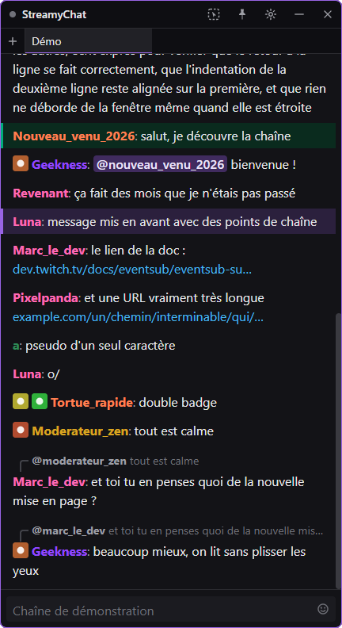
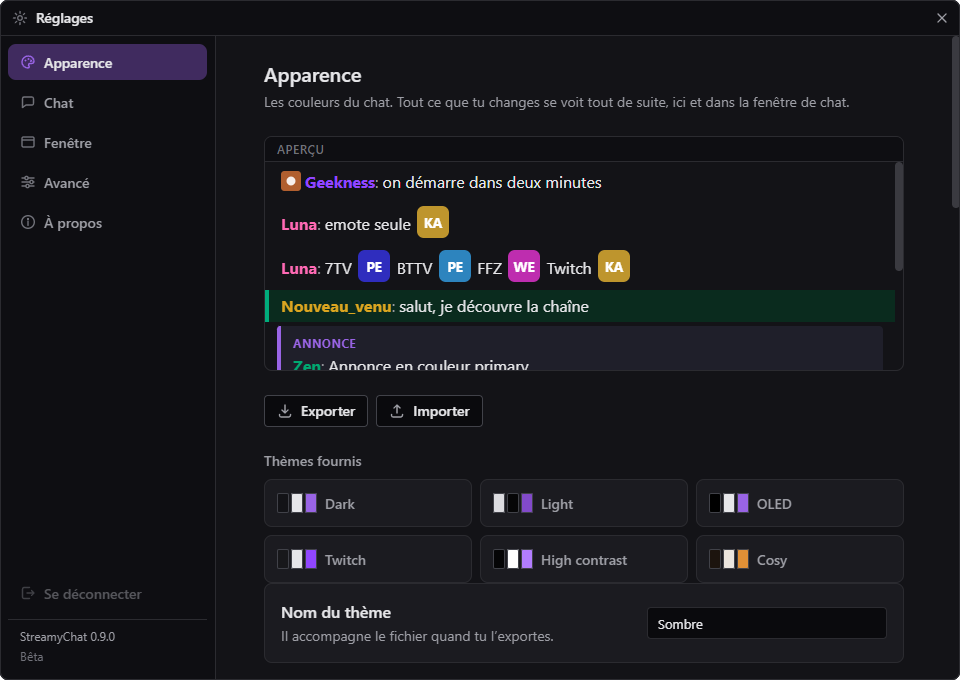

# StreamyChat

*[Read in English](README.md)*

Un client de chat Twitch pour Windows. Une fenêtre sans cadre, entièrement customisable, qui
remplace la pop-up de chat de Twitch : plusieurs chaînes à la fois, la modération intégrée, et
une tête que tu choisis vraiment.

Elle est faite pour des **streamers, pas pour des développeurs** : tout se règle dans
l'application. Aucun fichier à éditer, aucune ligne de commande, aucun jeton à coller.

> **C'est une bêta, et elle bouge encore.** C'est aussi une application qui marche : tu
> l'installes, tu te connectes à Twitch, tu lis ton chat. Des choses vont changer et certaines
> vont casser, et c'est ce qu'est une bêta. Ce qui est livré aujourd'hui, lui, reste.

*La fenêtre de chat. Les messages ci-dessus viennent d'une démonstration intégrée, pas d'une
vraie chaîne.*

*Chaque couleur, chaque police, chaque espacement est à toi. Un thème est un fichier que tu peux
exporter et partager.*

## Ce qu'elle fait aujourd'hui

- **Plusieurs chaînes à la fois**, dans des onglets que tu déplaces à la souris, pour les
  remettre dans l'ordre, les envoyer dans une autre fenêtre, ou en sortir un sur le bureau pour
  lui ouvrir sa propre fenêtre.
- **La modération complète** : timeout, ban, warn, suppression, mode lent, followers-only, et
  une fiche qui te dit qui tu t'apprêtes à sanctionner.
- **Les emotes tierces** : 7TV, BetterTTV et FrankerFaceZ, globales et par chaîne, animées
  comprises.
- **Une fenêtre qui ne gêne pas** : sans cadre, opacité réglable, coins arrondis, et un mode
  clic-à-travers où tes clics passent au travers du chat vers ce qu'il y a derrière.
- **Un éditeur de thème** : couleurs, polices, densité, tailles. Six thèmes sont fournis, et tu
  exportes le tien dans un fichier.
- **Ta chaîne, dans ton chat** : les points de chaîne, les sondages, les prédictions, les hype
  trains, tes objectifs, les coupures pub, les shoutouts et les nouveaux follows s'y affichent.

## Télécharger

**[Dernière version](https://github.com/geeknessfr/StreamyChat/releases/latest)**. Windows,
64 bits.

| Fichier | Ce qu'il fait |
|---|---|
| `StreamyChat-Setup-x.y.z.exe` | **Il installe.** Raccourci dans le menu Démarrer, désinstalleur propre, et il se met à jour tout seul. À prendre dans le doute. |
| `StreamyChat-x.y.z-portable.exe` | **Il n'installe rien.** Tes réglages vivent dans un dossier posé à côté du fichier. Pratique sur une clé USB ou un poste partagé. |

## Ce qui se passe après le téléchargement

**Windows va t'avertir, et c'est normal.** Tu vas avoir un écran bleu qui dit *« Windows a
protégé votre ordinateur »*. Il apparaît pour tout programme que Windows ne connaît pas encore.

1. Clique sur **Informations complémentaires**.
2. Clique sur **Exécuter quand même**.

**Pourquoi ça arrive :** l'application n'est pas encore signée par un certificat. Ça coûte de
l'argent et ça demande des semaines de démarches ; elle le sera, mais pas aujourd'hui. En
attendant, ce qui garantit le fichier est son empreinte SHA-512, publiée avec chaque version et
servie en HTTPS.

⚠️ **Ton antivirus peut aussi le mettre en quarantaine**, sans rien expliquer. C'est le même
problème vu d'un autre angle : un programme non signé que personne n'a encore téléchargé a l'air
suspect à un logiciel qui juge à la réputation. Si ça arrive, le fichier disparaît tout
simplement, donc regarde l'historique de ton antivirus avant de croire que le téléchargement a raté.

**Et si tu préfères ne pas passer outre ces avertissements, c'est un choix qui se tient.**
Attends une version signée.

## Où ça va

**StreamyChat aura des fonctionnalités payantes.** Autant le dire maintenant : personne ne
devrait le découvrir le jour où ça arrive.

**Ce seront des ajouts, jamais des retraits.** Tout ce qui est listé dans *« Ce qu'elle fait
aujourd'hui »* reste gratuit, pour de bon : les onglets, la modération, les emotes, le thème, la
fenêtre transparente, les événements de ta chaîne. C'est cette liste-là qui est la promesse, pas
une date.

Ce qui arrive s'appellera **StreamyChat xD**. Deux exemples de ce qu'elle est censée porter :

- **La lecture du chat à voix haute**, avec une correction automatique pour que `slt tt le
  monde` se prononce comme une phrase et pas comme des lettres.
- **Faire agir l'application quand tes viewers dépensent** : déclencher ses fonctionnalités sur
  les points de chaîne, les bits et les dons.

⚠️ **Pas de prix, pas de palier, pas de date.** Rien de tout ça n'est décidé, et un chiffre écrit
ici te serait ressorti le jour du lancement. C'est une intention, pas une feuille de route.

## Quelque chose ne marche pas

**Ouvre une [issue](https://github.com/geeknessfr/StreamyChat/issues), et joins le rapport de
problème** plutôt que de décrire ce qui s'est passé.

Réglages → **Avancé** → **Enregistrer le rapport** écrit un `.zip` là où tu veux. Il contient les
logs, un résumé de la session et tes réglages. **Tes jetons Twitch et tes clés d'API en sont
retirés avant écriture**. Ils n'y figurent pas, même en partie.

Ce fichier répond tout seul à la plupart des questions. Une description, rarement.

## La traduire

StreamyChat parle anglais et français. **Ajouter une langue ne demande pas d'être développeur.**

1. Installe [Poedit](https://poedit.net). C'est gratuit et ça fait une seule chose.
2. Ouvre [`lang/messages.pot`](lang/messages.pot), dans ce dépôt.
3. Traduis. Poedit te prévient si tu perds un `%s` ou un `%d`.
4. Envoie le fichier `.po` : en pull request, ou en pièce jointe d'une issue.

**Pour l'essayer avant de l'envoyer**, dépose ton `.po` dans le dossier `lang` de tes données et
relance. Réglages → Avancé → Langue.

⚠️ **Une traduction incomplète, ce n'est pas grave.** Ce qui manque retombe sur l'anglais, donc
l'application reste utilisable quel que soit le point où tu t'es arrêté.

Le détail est dans [CONTRIBUTING.md](CONTRIBUTING.md).

## Ce qui a changé

Chaque version, avec ce qu’elle apportait : [CHANGELOG.fr.md](CHANGELOG.fr.md).
[In English](CHANGELOG.md).

---

© 2026 Geekness. Sans lien avec Twitch.
