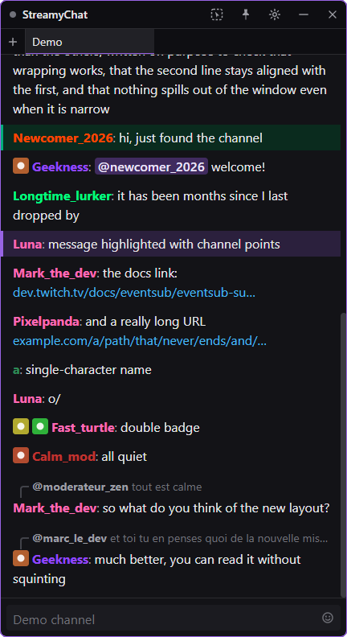
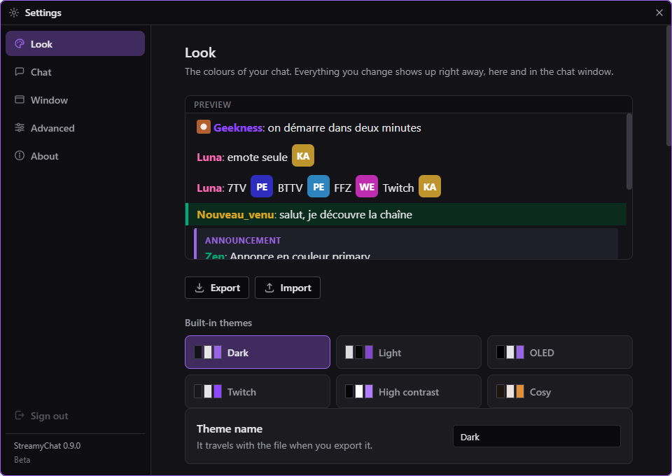

# StreamyChat

*[Lire en français](LISEZMOI.md)*

A Twitch chat client for Windows. One frameless, fully themeable window that replaces Twitch's
chat pop-out: several channels at once, moderation built in, and a look you actually choose.

It is built for **streamers, not developers**: everything is configured inside the app. No file
to edit, no command line, no token to paste.

> **This is a beta, and it is in active development.** It is also a working application: install
> it, sign in with Twitch, and read your chat. Things will change and some will break, and that is
> what a beta is. Everything that ships today is here to stay.

*The chat window. The messages above come from a built-in demo, not from a real channel.*

*Every colour, font and spacing is yours. A theme is a file you can export and share.*

## What it does today

- **Several channels at once**, in tabs you can drag: reorder them, move them to another
  window, or pull one out onto the desktop to give it its own window.
- **Full moderation**: timeout, ban, warn, delete, slow mode, followers-only, and a user card
  that tells you who you are about to sanction.
- **Third-party emotes**: 7TV, BetterTTV and FrankerFaceZ, global and per channel, animated
  ones included.
- **A window that gets out of the way**: no frame, adjustable opacity, rounded corners, and a
  click-through mode that lets your clicks reach whatever is behind the chat.
- **A theme editor**: colours, fonts, density, sizes. Six themes come with it, and you can
  export yours as a file.
- **Your channel, out loud**: channel point redemptions, polls, predictions, hype trains,
  goals, ad breaks, shoutouts and new follows all show up in the chat.

## Download

**[Latest release](https://github.com/geeknessfr/StreamyChat/releases/latest)**. Windows,
64-bit.

| File | What it does |
|---|---|
| `StreamyChat-Setup-x.y.z.exe` | **Installs.** Start menu shortcut, clean uninstaller, and it updates itself. Take this one if you are not sure. |
| `StreamyChat-x.y.z-portable.exe` | **Installs nothing.** Settings live in a folder next to the file. Good for a USB stick or a shared machine. |

## What happens after you download it

**Windows will warn you, and that is expected.** You will get a blue screen saying *"Windows
protected your PC"*. It appears for every program Windows does not recognise yet.

1. Click **More info**.
2. Click **Run anyway**.

**Why it happens:** the application is not signed with a code-signing certificate yet. Those
cost money and take weeks of paperwork; it will be signed, but not today. Until then, what
guarantees the file is the SHA-512 checksum published with every release and served over HTTPS.

⚠️ **Your antivirus may also quarantine it**, without explaining why. That is the same problem
seen from another angle: an unsigned program nobody has downloaded yet looks suspicious to
software that judges by reputation. If it happens, the file will simply vanish, so check your
antivirus history before assuming the download failed.

**If you would rather not click past those warnings, that is a perfectly reasonable position.**
Wait for a signed release.

## Where this is going

**StreamyChat will get paid features.** Saying so now rather than later: nobody should discover
it the day it happens.

**They will be additions, never removals.** Everything listed under *"What it does today"* above
stays free, permanently: the tabs, the moderation, the emotes, the theming, the transparent
window, the channel events. That list is the promise, not a date.

What is coming is a paid edition called **StreamyChat xD**. Two examples of what it is meant to
carry:

- **Reading chat out loud**, with an automatic cleanup pass so that `slt tt le monde` is spoken
  as a sentence rather than as letters.
- **Doing things when your viewers spend**: triggering the app's features from channel points,
  bits and donations.

⚠️ **No price, no tier, no date.** None of it is decided, and a number written here would be
quoted back on the day it launches. This is an intention, not a roadmap.

## Something is broken

**Open an [issue](https://github.com/geeknessfr/StreamyChat/issues), and attach the problem
report** rather than describing what happened.

Settings → **Advanced** → **Save the report** writes a `.zip` next to wherever you choose. It
contains the log, a summary of the session and your settings. **Your Twitch tokens and API keys
are stripped out before it is written**. They are not in there, not even partially.

That file answers most questions on its own. A description rarely does.

## Translating it

StreamyChat speaks English and French. **Adding a language does not require a developer.**

1. Install [Poedit](https://poedit.net). It is free and it does one thing.
2. Open [`lang/messages.pot`](lang/messages.pot) from this repository.
3. Translate. Poedit warns you if you drop a `%s` or a `%d`.
4. Send the `.po` file: as a pull request, or attached to an issue.

**To try it before sending it**, drop your `.po` into the `lang` folder of your data directory
and restart. Settings → Advanced → Language.

⚠️ **An unfinished translation is fine.** Whatever is missing falls back to English, so the
application stays usable no matter how far you got.

See [CONTRIBUTING.md](CONTRIBUTING.md) for the details.

---

© 2026 Geekness. Not affiliated with Twitch.
